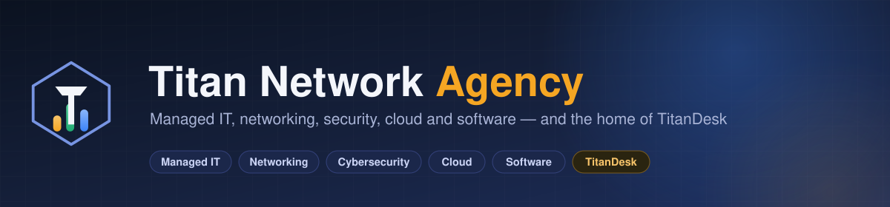
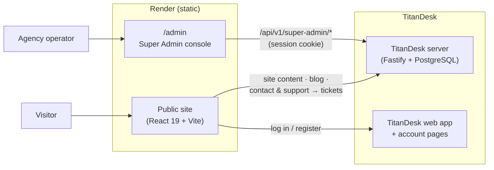

<div align="center">



**The public site of Titan Network, an IT solutions agency — plus the Super Admin console for its TitanDesk platform.**

Services, product pages, pricing, blog, careers and contact, in English and German. Every contact or support message becomes a real ticket in Titan Network's own TitanDesk.

[](#stack)
[](#stack)
[](#architecture)
[](#deployment)
[](#whats-built)
[](#)

</div>

---

## Contents

- [The idea](#the-idea)
- [Design principles](#design-principles)
- [What's built](#whats-built)
- [Architecture](#architecture)
- [Stack](#stack)
- [Getting started](#getting-started)
- [Deployment](#deployment)
- [Repo structure](#repo-structure)

---

## The idea

**Titan Network** is an IT services agency — managed IT, networking, cybersecurity, cloud and custom software for businesses in Kosovo, Albania and remote clients worldwide. This repo is its public face: what the agency does, the products it builds, and how to get in touch.

It is also where the agency *operates* its products from. The **Super Admin** console at `/admin` manages the TitanDesk platform (organizations, users, support, feature flags, audit log, data-privacy requests, and the site's own content). It is an agency tool, not part of what tenants see, which is why it lives here and not inside the TitanDesk app.

> The site holds no data of its own. Content, contact and support requests, sign-in and every Super Admin action go through the **TitanDesk server** (`TitanNetwork-main/server`) over HTTP. Nothing platform-sensitive is duplicated or stored in this repo.

## Design principles

| Principle | What it means in practice |
|---|---|
| **Show the product, not a screenshot** | The TitanDesk section is a working miniature built from the product's own layout code and design tokens, with sample data — visitors can click around instead of looking at a static image. |
| **Nothing fabricated** | Clients and testimonials only appear once they are published from Super Admin with permission. No stock logos, no invented quotes, no fake counters. |
| **Private by default** | No analytics, advertising or tracking scripts; fonts are self-hosted. The only cookie is TitanDesk's own sign-in cookie for people who use TitanDesk. |
| **Every message lands somewhere real** | The contact form and the "Talk to us" widget file tickets in Titan Network's own TitanDesk and give the visitor a reference back. |
| **One account, many products** | Log in / Register send visitors to the shared account pages, not a TitanDesk-only sign-in, so the same account covers future Titan Network products. |

## What's built

| Area | Summary |
|---|---|
| **Home** | Hero, services, proof, product showcase with interactive "how it works" diagrams, process, technologies, pricing, FAQ and contact. |
| **Services** | Services overview plus a detail page per service (`/services/:slug`). |
| **TitanDesk** | Product page with the interactive replica, network and reports views, plans, an Enterprise page and product terms. |
| **Pricing** | Team / Business / Enterprise plans, read from site content edited in Super Admin. What a plan unlocks is set in the product; what customers pay is set by the Stripe price. |
| **Blog** | Posts list and article pages, written and published from Super Admin. |
| **Careers** | Open roles from Super Admin; closed roles stay stored but hidden. |
| **Contact & support** | Contact form and a sitewide "Talk to us" widget (questions and bug reports) that create TitanDesk tickets. |
| **Legal** | Imprint, Privacy, Terms, Refunds and Security pages, filled in from the company details in Super Admin. |
| **Languages** | Full English and German (`/de/...`) with per-language SEO metadata; German falls back to English where content hasn't been written yet. |
| **Accounts** | `/login`, `/register` and `/forgot-password` hand off to the shared account pages; signed-in visitors get a "Go to workspace" link. |
| **Super Admin (`/admin`)** | Overview, organizations, users, support cases, feature flags, audit logs, data-privacy requests, blog and website content. [Details ▾](#super-admin-details) |

<details id="super-admin-details">
<summary><strong>Super Admin — full detail</strong></summary>

A thin client over the TitanDesk server's `/api/v1/super-admin/*` routes, authenticated with the same HttpOnly session cookie the product's own sign-in sets, so there is one control plane and one session model.

- **Organizations & users** — cross-workspace lists and detail pages, including workspace suspension.
- **Support** — audited support cases linked to real organizations and tickets.
- **Feature flags** — global flags with per-organization overrides.
- **Audit logs** and **data-privacy** export/retention/deletion requests.
- **Blog** — write and publish posts.
- **Website** — edit company details, plans and prices, jobs, clients and testimonials in English and German, then publish.

The console is code-split and only loads on `/admin`. With `VITE_APP_MODE` it can also be built on its own (e.g. for an admin subdomain) or left out of the public build entirely.
</details>

## Architecture

The site is a static build. Everything dynamic comes from the TitanDesk server, which stays the only trust boundary.



For the session cookie to travel cross-origin, the server's `TITANDESK_ALLOWED_ORIGINS` must include this site's origin.

## Stack

| Layer | Technology |
|---|---|
| UI | React 19 · TypeScript · Vite · React Router 7 |
| Styling | Tailwind CSS v4 · lucide-react icons · self-hosted Inter & DM Sans |
| SEO | react-helmet-async · JSON-LD · sitemap and robots |
| Tooling | oxlint · TypeScript project references |
| Hosting | Render static sites (public site and Super Admin as separate builds) |

## Getting started

```bash
npm install
cp .env.example .env
npm run dev      # http://127.0.0.1:5190
```

Run the TitanDesk server too (`TitanNetwork-main/server`, port 4100) for anything that talks to it: session status, site content, the contact form and support widget, and `/admin`.

| Variable | Purpose |
|---|---|
| `VITE_TITANDESK_API_URL` | TitanDesk server the site and `/admin` call (default `http://127.0.0.1:4100`). |
| `VITE_TITANDESK_WEB_URL` | Where the TitanDesk app runs; signed-in visitors are sent here. |
| `VITE_ACCOUNT_URL` | Optional shared account pages. Defaults to `VITE_TITANDESK_WEB_URL` until a separate accounts app exists. |
| `VITE_APP_MODE` | `all` (default) builds site + console; `marketing` drops the console from the bundle; `admin` builds only the console. |
| `VITE_ADMIN_URL` | In `marketing` mode, where `/admin` redirects to. |

> Open the site as `http://127.0.0.1:5190`, not `localhost:5190`. The session cookie is `SameSite=Lax` in local dev, and the two hostnames don't count as the same site, so `/admin` calls silently lose the cookie.

Contact and support messages become tickets only when the server has `TITANDESK_SUPPORT_WORKSPACE_ID` set.

## Deployment

Render builds this repo as two static sites, defined in the TitanNetwork repo's
[`render.yaml`](https://github.com/ErdrinPervizaj-EP/TitanNetwork/blob/main/render.yaml)
blueprint next to the TitanDesk server and app, and redeploys both on every push to `master`:

| Site | Build | Address |
|---|---|---|
| Public site | `VITE_APP_MODE=marketing` (no Super Admin code in the bundle) | https://titan-agency.onrender.com |
| Super Admin | `VITE_APP_MODE=admin` | https://titan-agency-admin.onrender.com/admin |

Both call the TitanDesk server at `VITE_TITANDESK_API_URL`, whose `TITANDESK_ALLOWED_ORIGINS` lists both addresses.
The GitHub Pages workflow in `.github/workflows/deploy.yml` still works (`GITHUB_PAGES=true` sets the base path to
`/titan-agency/`) if you'd rather publish there.

## Repo structure

| Path | Contents |
|---|---|
| [`src/pages/`](./src/pages) | Routed pages — Home, Services, TitanDesk, Enterprise, Blog, Careers, Legal |
| [`src/components/`](./src/components) | Page sections (Hero, Features, ProductShowcase, Pricing, Faq, Contact, Footer, SupportWidget) |
| [`src/components/replica/`](./src/components/replica) | Working miniature of TitanDesk built from the product's layout code and design tokens |
| [`src/components/diagrams/`](./src/components/diagrams) | Interactive "how it works" diagrams |
| [`src/admin/`](./src/admin) | Super Admin console (loaded only on `/admin`) |
| [`src/i18n/`](./src/i18n) | English/German copy and legal page text |
| [`src/lib/`](./src/lib) | TitanDesk API client, session, site content and account links |
| [`public/`](./public) | Favicon, Open Graph image, `robots.txt`, `sitemap.xml` |
| [`docs/assets/`](./docs/assets) | README banner |
